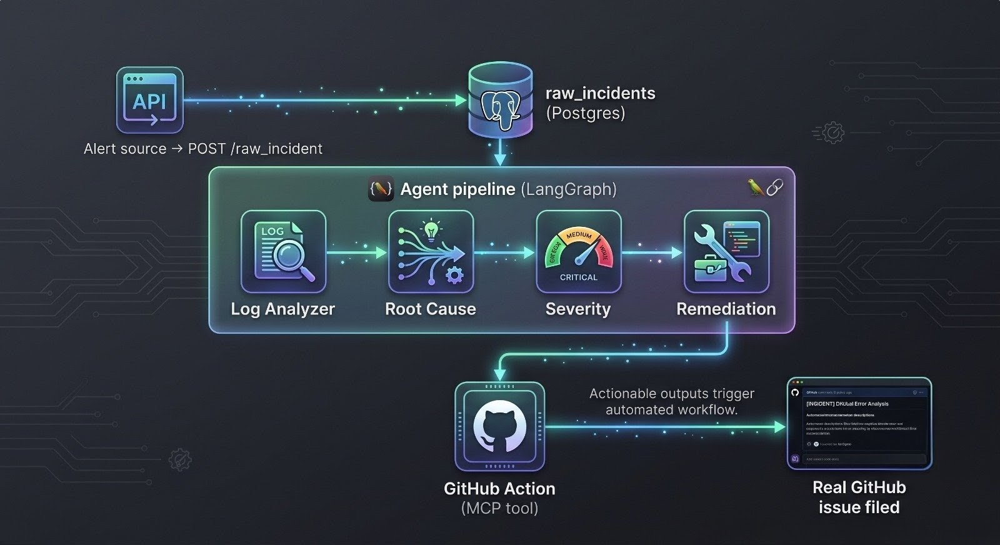

<div align="center">

# Sentinel — Autonomous Incident Response Pipeline
**Multi-agent AI system for autonomous production incident diagnosis, triage, and remediation.**

<p align="center">
  
  
  
  
  
  
  
  
  
  
  
</p>

</div>

## What it does

1. **Ingests** a raw incident log via a REST endpoint (webhook-style)
2. **Extracts** structured fields (service, error type, endpoint, occurrence count) using an LLM
3. **Reasons** about the likely root cause, grounded in the extracted evidence
4. **Classifies severity** (P1–P4) based on business impact, not just technical symptoms
5. **Drafts a remediation plan** with concrete, actionable steps
6. **Files a real GitHub issue** automatically via a custom-built MCP tool server

Every stage's output — including confidence scores — is persisted for full auditability.

## Architecture


Each agent is a separate, independently testable class with its own structured-output schema. LangGraph orchestrates the sequence via a shared state object that accumulates results as it flows through the pipeline. GitHub issue creation goes through a genuine MCP client-server pair — the server runs as a standalone process, discovered and invoked over the actual MCP protocol, not a direct function call.

## Example run

**Input** (synthetic incident, checkout service):
ERROR [checkout-svc] java.sql.SQLTimeoutException: Connection to database
timed out after 30000ms while committing order transaction
[repeated 12 times in last 3 min] [endpoint: /api/v1/checkout/finalize]

**Output** (abbreviated):

| Stage | Result |
|---|---|
| Root Cause | "Database lock contention or slow-running queries during commitOrder execution... transaction exceeding the configured SQL timeout" (confidence: medium) |
| Severity | **P2** — "Directly blocks users from completing transactions, representing a significant degradation of a key revenue workflow" (confidence: high) |
| Remediation | 3-tier plan: increase transaction timeout → run `EXPLAIN ANALYZE` for missing indexes → add retry-with-backoff |
| GitHub Action | Issue auto-filed with full markdown report, labeled `P2` |

## Evaluation

Manually scored across varied test incidents spanning the full severity range:

| Test case | Extraction | Severity | Root cause quality | Fix specificity |
|---|---|---|---|---|
| Checkout DB timeout (revenue-blocking) | 100% correct | **P2** — correctly escalated, tied to revenue impact | Specific, named exact method/line | 3-tier, concrete (index check, retry policy) |
| Search input validation (benign rejection) | 100% correct | **P4** — correctly resisted escalation | Reasoned from *absence* of evidence, not just presence | Correctly recommended "no action, monitor" |

**Key finding:** the Severity Agent discriminates rather than defaulting to a middle value — a revenue-blocking failure and a correctly-rejected client input were classified four severity levels apart, each with defensible reasoning. The Remediation Agent also correctly identifies when *no* fix is warranted, rather than always proposing action.

## Observability

All agent calls are traced end-to-end via LangSmith — each `/process` run produces one connected trace covering all 5 pipeline stages, including token usage, latency, and the full prompt/response for every LLM call.

## Setup

```bash
# 1. Clone
git clone https://github.com/arun-nivaas/sentinel-incident-response.git
cd sentinel-incident-response

# 2. Configure environment
cp .env.example .env
# Fill in DATABASE_URL, GOOGLE_API_KEY (free at aistudio.google.com/apikey),
# GITHUB_TOKEN + GITHUB_REPO_OWNER + GITHUB_REPO_NAME, and optionally LangSmith keys

# 3. Install dependencies
uv sync

# 4. Run migrations
alembic upgrade head

# 5. Start the server
uv run uvicorn app.main:app --reload
```

Visit `http://127.0.0.1:8001/docs` for the interactive API.

## Known limitations

- `/process` runs the full pipeline as one atomic graph invocation — if it fails mid-way, a retry restarts from the beginning rather than resuming from the last successful stage. A LangGraph checkpointer (`PostgresSaver`) would enable true resumability.
- Root Cause reasoning currently relies on the LLM's general knowledge, not retrieval against historical incidents (RAG). The knowledge base and agent structure are in place; retrieval wiring is planned.
- No autonomous retry/replan loop yet — a low-confidence Severity classification doesn't currently trigger re-analysis, though the conditional-edge mechanism to support this is straightforward to add on top of the existing graph.

## Future work

- RAG-grounded root cause analysis against a postmortem knowledge base (pgvector)
- Conditional retry loop when agent confidence is low
- Additional MCP tools (Slack notifications, Jira)
- Automated evaluation harness with LLM-as-judge scoring, run as a regression check on every prompt change
- Docker + cloud deployment for live integration with real production services
